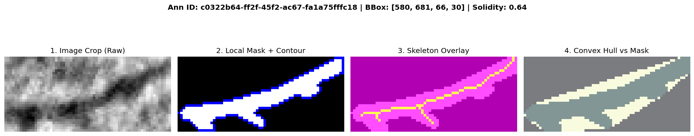
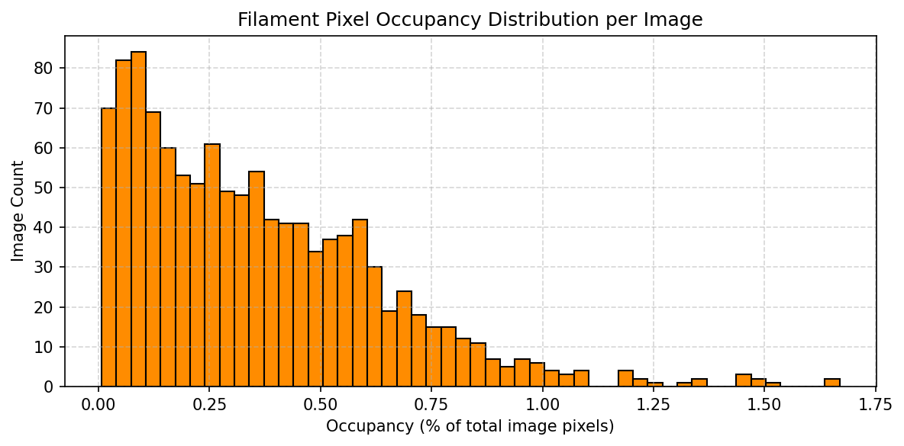
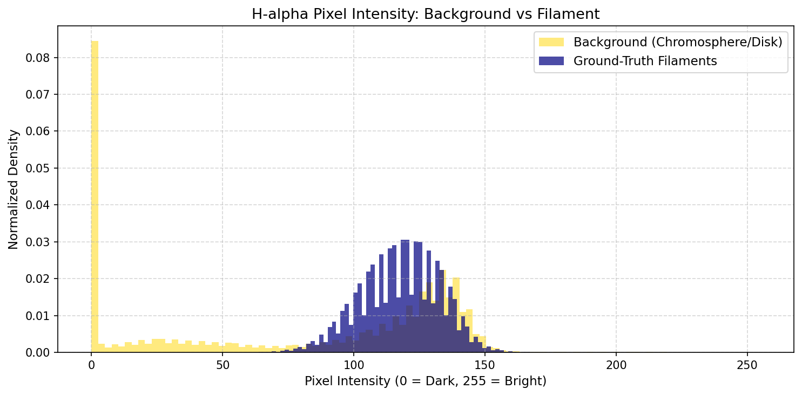
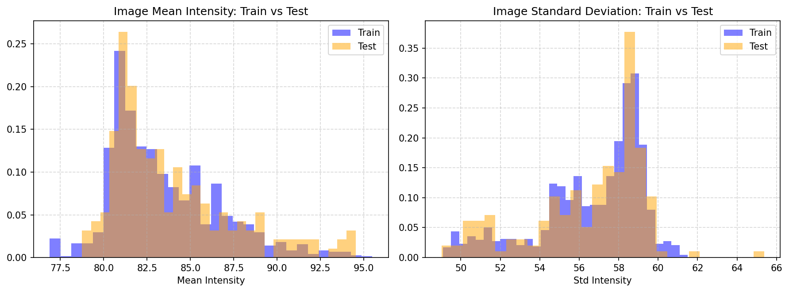
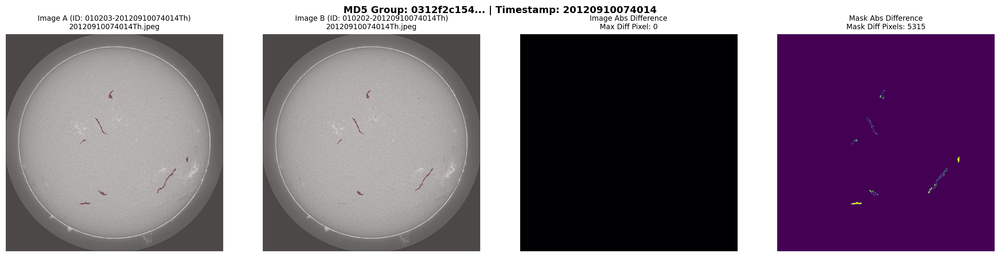
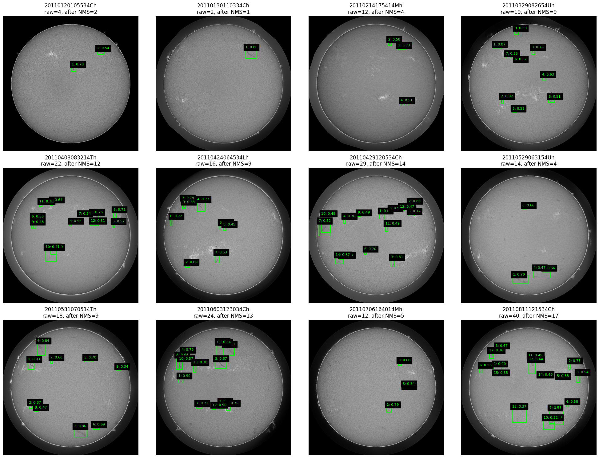

---
title: "Solar Filament Detection"
subtitle: "YOLO11M + U-Net Instance Segmentation"
description: "A high-resolution solar filament segmentation pipeline featuring MAGFiLO dataset analysis, duplicate-aware validation, YOLO11M detection, and a five-fold U-Net ensemble."
date: "2026-10-08"
image: "example.png"
categories:
  - Computer Vision
  - Image Segmentation
  - Deep Learning
---

# Solar Filament Detection

A machine learning pipeline for solar filament detection and instance segmentation, developed as part of a Kaggle competition.

Solar filaments are dense, relatively cool clouds of solar material (plasma) suspended above the Sun's surface by powerful magnetic field lines.

## 1. The Visual Appearance

Although solar filaments are extremely hot, they are cooler than the photosphere below them. In H-alpha observations, they absorb light from the solar disk and appear as dark, thread-like streaks or ribbons across the bright Sun.

When viewed against the blackness of space at the edge of the Sun, the same structures appear bright and are called solar prominences.

## 2. Why Solar Filaments Matter

Solar filaments can become unstable when the magnetic fields that hold them in place change. Their eruptions can be associated with coronal mass ejections (CMEs), which may affect:

- Electric power grids
- GPS navigation and satellite communications
- Astronauts and high-altitude polar flights exposed to increased radiation

Accurate segmentation of solar filaments can support the analysis of their structure and evolution.

## Overview

The objective of this project is to generate accurate, pixel-level instance segmentation masks from H-alpha solar observations.

The project investigates a two-stage pipeline that combines object detection and segmentation to preserve fine filament structures while separating individual instances.

- **Dataset:** MAGFiLO
- **Input resolution:** 2048 × 2048 pixels
- **Detector:** YOLO11M
- **Segmentation model:** U-Net with a ResNet34 encoder
- **Ensembling:** Five fold-specific segmentation models
- **Evaluation metric:** Panoptic Quality (PQ)

[View the GitHub repository](https://github.com/saint1st/cv-solar-filament-detection) · [Kaggle competition](https://www.kaggle.com/competitions/filament-segmentation-2026/overview)

## Dataset: MAGFiLO

The models are trained and evaluated on **MAGFiLO (Manually Annotated GONG Filaments from H-alpha Observations)**.

### Image specifications

| Property | Description |
|---|---|
| Image dimensions | 2048 × 2048 pixels |
| Format | 8-bit JPEG |
| Color space | Grayscale |
| Filename format | `YYYYMMDDHHMMSSII` |

For example, `20260901165702Bh.jpeg` encodes the capture date, time, and observatory identifier.

### Training image examples

{fig-align="center" width="75%"}

{fig-align="center" width="75%"}

### Annotation format

Ground-truth filament instances are represented as polygons encoded using Run-Length Encoding (RLE), allowing compact storage and conversion to binary masks.

A single H-alpha observation may contain multiple filaments. The same underlying image may also appear in multiple records annotated independently, creating duplicate observations and overlapping annotations that require careful handling.

## Exploratory Data Analysis

The dataset contains **1,154 images and 8,199 annotations**.

The EDA investigated filament size, shape, branching, overlap, pixel occupancy, intensity distributions, temporal sampling, and duplicate observations.

### 1. Filament area distribution

Filament areas vary substantially, from small, thin structures to large and complex instances.

| Percentile | Area (pixels) | Interpretation |
|---|---:|---|
| P1 | 209 | Lower bound, excluding extreme outliers |
| P5 | 317 | Very small structures |
| P10 | 410 | Small filament threshold |
| P25 | 670 | Lower quartile |
| P50 | 1,228 | Median |
| P75 | 2,438 | Upper quartile |
| P90 | 4,685 | Large structures |
| P95 | 6,947 | Very large structures |
| P99 | 13,703 | Upper bound, excluding extreme values |

The observed area distribution extends from 9 to 37,739 pixels.

{fig-align="center" width="85%"}

This analysis informed two important design choices:

- **Receptive field:** Large structures require models capable of capturing broad spatial context.
- **Resolution preservation:** Aggressive downscaling from 2048 × 2048 to 640 × 640 risks losing fine structures and morphological details.

### 2. Instance geometry and skeleton analysis

To characterize individual filaments, the analysis examined area, aspect ratio, perimeter, solidity, and skeleton length.

Solidity measures the ratio between a mask's area and the area of its convex hull. Skeletonization extracts a filament's central spine and helps reveal its branching structure.

{fig-align="center" width="85%"}

{fig-align="center" width="85%"}

{fig-align="center" width="85%"}

The analysis revealed several important characteristics:

- **Branching and barbs:** Thin secondary branches extend from the primary filament spine.
- **Irregular geometry:** Filaments are elongated and often highly non-convex.
- **Fine structures:** Small branches can be lost through resizing or aggressive preprocessing.

These characteristics make pixel-level segmentation more suitable than bounding boxes alone.

#### Geometric statistics

| Statistic | Area (px) | Aspect ratio | Perimeter (px) | Solidity | Skeleton length (px) |
|---|---:|---:|---:|---:|---:|
| Count | 8,199 | 8,199 | 8,199 | 8,199 | 8,199 |
| Mean | 2,282.9 | 1.38 | 390.2 | 0.58 | 176.1 |
| Std | 2,860.4 | 1.03 | 318.5 | 0.18 | 158.3 |
| Min | 6.0 | 0.12 | 6.8 | 0.10 | 3.0 |
| 5% | 354.0 | 0.33 | 105.6 | 0.28 | 37.0 |
| 25% | 745.5 | 0.66 | 183.3 | 0.45 | 74.0 |
| 50% | 1,355.0 | 1.11 | 292.4 | 0.58 | 127.0 |
| 75% | 2,638.0 | 1.79 | 488.1 | 0.71 | 221.0 |
| 95% | 7,336.7 | 3.34 | 1,026.6 | 0.89 | 487.1 |
| Max | 39,145.0 | 12.78 | 3,047.5 | 1.00 | 1,777.0 |

### 3. Area, aspect ratio, and skeleton length

{fig-align="center" width="90%"}

The bivariate analysis provides additional insights:

1. **Area vs. aspect ratio:** Filament orientations vary across the dataset, making it important to avoid assumptions about a dominant direction.
2. **Area vs. skeleton length:** These quantities exhibit a strong relationship in log-log space. Their ratio may provide a useful heuristic for identifying morphologically unusual predictions.
3. **Pixel-level imbalance:** Filament pixels occupy only a small fraction of each image, making foreground-background imbalance a central training challenge.

### 4. Instance overlap

Most images contain multiple filament instances, but direct overlap between annotated masks is relatively uncommon.

| Metric | Count | Percentage / proportion |
|---|---:|---:|
| Images with at least 2 filaments | 1,051 | 91.1% |
| Images with overlapping masks | 7 | 0.6% |
| Images with touching masks | 8 | 0.7% |
| Overlapping instance pairs | 7 | 7 / 36,064 pairs |
| Touching instance pairs | 9 | 9 / 36,064 pairs |

Even when overlap is uncommon, correctly separating instances remains important because the competition evaluates instance-level predictions.

### 5. Pixel-level class imbalance

Each image contains 4,194,304 pixels, but the filament foreground occupies only a small proportion of the image.

{fig-align="center" width="85%"}

The estimated mean foreground occupancy is approximately **0.30%**.

This imbalance can cause a model trained with standard Binary Cross-Entropy (BCE) alone to favor background predictions.

To address this issue, the experiments investigated composite losses such as:

- BCE + Dice Loss
- BCE + Tversky Loss
- Focal Loss + Dice Loss

These objectives combine pixel-level classification with measures of overlap.

### 6. Image intensity distributions

{fig-align="center" width="85%"}

Sampling intensity distributions across 100 images revealed substantial overlap between background pixels and filament pixels.

- The spike near zero primarily represents the dark space outside the solar disk.
- Filament intensities overlap with the broader intensity distribution of the solar disk.
- Global thresholding methods such as Otsu's method cannot reliably distinguish filaments from the surrounding solar surface.

**Preprocessing strategy:** CLAHE (Contrast Limited Adaptive Histogram Equalization) was incorporated to enhance local contrast before model training.

### 7. Temporal sampling and validation leakage

Image timestamps extracted from filenames revealed the temporal structure of the dataset.

- **Dataset span:** January 9, 2011, to August 3, 2022.
- **Observation days:** 656 unique days.
- **Median interval between sequential frames:** 1,440 minutes (24 hours).
- **Closely sampled observations:** 456 frames, or 39.5%, were captured less than 15 minutes apart.

Temporally correlated observations can be very similar. Randomly assigning these images to different folds risks overestimating validation performance.

For this reason, the validation strategy uses grouping to keep duplicate or correlated observations together.

### 8. Adversarial validation

An adversarial validation experiment was used to investigate potential differences between training and test images.

The experiment extracted image intensity statistics, including mean, standard deviation, and selected percentiles, then trained a Random Forest classifier to distinguish training samples from test samples using five-fold cross-validation.

{fig-align="center" width="85%"}

| Metric | Result |
|---|---|
| ROC-AUC | 0.559 |
| Interpretation | Limited ability to distinguish training and test samples |
| Conclusion | No severe covariate shift detected by these features |

The result is close to 0.50, suggesting that the selected low-level intensity features have limited power to distinguish the two sets. It does not rule out every possible distribution shift.

### 9. Duplicate analysis and annotation fusion

Duplicate analysis used byte-level MD5 hashing and timestamp-prefix matching to identify redundant observations.

| Finding | Result |
|---|---:|
| Images mapped to exact duplicate groups | 743 |
| Unique duplicate groups | 296 |
| Original image records | 1,154 |
| Clean unique frames after fusion | 707 |
| Preserved filament annotations | 8,199 |

By fusing annotations across duplicate records and selecting a primary frame for each hash group, the dataset was reduced from **1,154 records to 707 clean, unique frames**, while preserving the annotations.

{fig-align="center" width="85%"}

{fig-align="center" width="85%"}

{fig-align="center" width="85%"}

The resulting annotations were serialized into:

`MAGFiLO_1.0_Annotations_kaggle2026_train_fused_deduplicated.json`

#### GroupKFold validation

A unified `group_id` mapping was generated and saved to `train_image_groups.csv`.

GroupKFold uses these identifiers to keep duplicate observations in the same fold, reducing leakage between training and validation sets.

## Methodology

The final approach is a two-stage detection and segmentation pipeline designed to preserve the fine structure of solar filaments.

### Pipeline architecture

{fig-align="center" width="100%"}

### Stage 1: Image preprocessing

- Convert images to grayscale.
- Isolate the solar disk using an intensity threshold.
- Apply CLAHE to enhance local contrast.
- Preserve the original 2048 × 2048 resolution for detector input.

### Stage 2: YOLO11M instance detection

YOLO11M detects filament instances on the full-resolution solar image.

The detector is configured to operate at a 1280-pixel input resolution in the best-performing configuration. Detected bounding boxes are used to extract regions of interest.

### Stage 3: ROI segmentation

Each detected region is cropped with approximately 20% padding and resized to 512 × 512 pixels.

A U-Net with a ResNet34 encoder predicts the filament mask inside each crop.

This design allows the segmentation model to focus on local structures while relying on the detector to localize instances.

### Stage 4: Five-fold ensemble

Five fold-specific U-Net models are ensembled by averaging their predicted probability maps.

Probability averaging reduces dependence on a single segmentation model and combines predictions from multiple training folds.

### Stage 5: Post-processing

The final predictions undergo:

1. Probability thresholding.
2. Panoptic Painting to resolve overlaps between predicted instances.
3. Conversion of instance masks into the required RLE representation.

The resulting predictions are serialized in the format required by the competition.

## Model and Experiment Summary

The project evolved from full-image semantic segmentation into a two-stage YOLO → U-Net instance segmentation pipeline.

The primary evaluation metric is **Panoptic Quality (PQ)** on the Kaggle leaderboard.

### Kaggle results

| # | Architecture / strategy | Resolution and setup | Configuration | Kaggle PQ |
|---:|---|---|---|---:|
| 1 | Baseline U-Net | 2048 → 512 | BCE + Dice, connected components | 0.01 |
| 2 | Oracle GT BBox + U-Net | Ground-truth crops → 512 | Upper-bound benchmark | Local validation |
| 3 | Two-stage YOLO + U-Net | YOLO 1280, crop 512 | Detection + ROI segmentation | ~0.30 |
| 4 | YOLO + U-Net, EfficientNet-B4 | YOLO 1280, crop 512 | Heavier segmentation backbone | 0.26 |
| 5 | Two-stage variants | YOLO 1280, crop 512 | Flip TTA and 5 × 5 hole filling | ~0.26 |
| 6 | YOLO11M + U-Net, five-fold ensemble | 1280 + crop 512 | Five segmentation folds | 0.29 |
| 7 | YOLO11M confidence sweep | 1280 | Best tested confidence: 0.30 | 0.29 |
| 8 | YOLO11L scaling experiments | 1280 / 1536 / 2048 | Resolution, epochs, and optimizer | 0.28 |
| 9 | YOLO11M tiled training | 1024 × 1024 tiles | Tiling with 20% overlap | In progress |

> **Best reported Kaggle score: approximately 0.30 PQ.**

The two-stage approach substantially improved upon the initial full-image U-Net baseline. The results also indicate that detector localization and recall are important bottlenecks for instance-level segmentation.

### Final pipeline

**2048 × 2048 image → Solar disk isolation + CLAHE → YOLO11M detection → 20% padded crops → U-Net ResNet34 five-fold ensemble → Probability averaging → Thresholding → Panoptic Painting → RLE output**

### Key findings

- **Instance-level evaluation:** A full-image U-Net achieved approximately 0.70 Dice in validation but only 0.01 PQ on the leaderboard. Pixel-level overlap alone did not translate into strong instance-level results.
- **Two-stage architecture:** Combining YOLO-based detection with ROI segmentation improved the competition score substantially.
- **Backbone selection:** ResNet34 performed better than the tested EfficientNet-B4 configuration.
- **Post-processing:** Test-time augmentation and coarse morphological operations did not consistently improve PQ.
- **Ensembling:** Combining five segmentation models improved robustness, although performance varied across folds.
- **Detector configuration:** YOLO11M outperformed the tested YOLO11L configurations. Increasing the input resolution to 2048 did not improve the best reported result.
- **Remaining limitation:** Thin, faint, and low-contrast filaments are still difficult for the detector to localize reliably.

## Results on Test Images

{fig-align="center" width="100%"}

The test-set visualizations help assess how the final pipeline handles filament localization, mask boundaries, thin structures, and separation between instances.

## Future Work

1. **Improve detector recall**

   Investigate stronger data augmentation, hard-negative mining, and multi-scale training.

2. **Improve thin-filament detection**

   Develop preprocessing and training strategies specifically targeting faint, thin, and low-contrast structures.

3. **Improve instance separation**

   Reduce split and merge errors between neighboring or touching filaments.

4. **Explore alternative detection architectures**

   Investigate DETR, RT-DETR, transformer-based detectors, and oriented bounding boxes.

5. **Explore stronger segmentation backbones**

   Evaluate ConvNeXt, Swin Transformer, and other high-capacity segmentation architectures.

6. **Exploit temporal information**

   Consecutive solar observations could provide useful temporal priors for filament detection and tracking.

7. **Improve post-processing**

   Investigate instance-aware refinement, geometric constraints, and more sophisticated mask separation methods.

## Conclusion

This project developed a two-stage **YOLO11M + U-Net ResNet34 ensemble** for solar filament instance segmentation.

The pipeline combines high-resolution detection, padded ROI crops, five-fold segmentation ensembling, and instance-aware post-processing. Dataset analysis and duplicate-aware validation were important components of the workflow.

The best reported competition result was approximately **0.30 Panoptic Quality**. Improving detector recall for thin and faint filaments remains a key direction for future work.

## Links

- [GitHub repository](https://github.com/saint1st/cv-solar-filament-detection)
- [Kaggle competition](https://www.kaggle.com/competitions/filament-segmentation-2026/overview)
